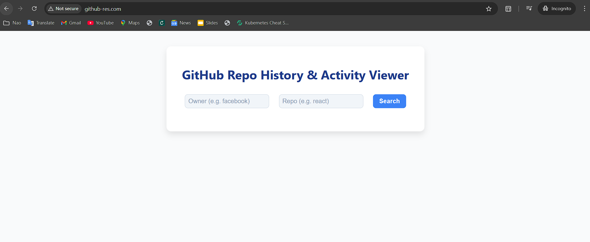
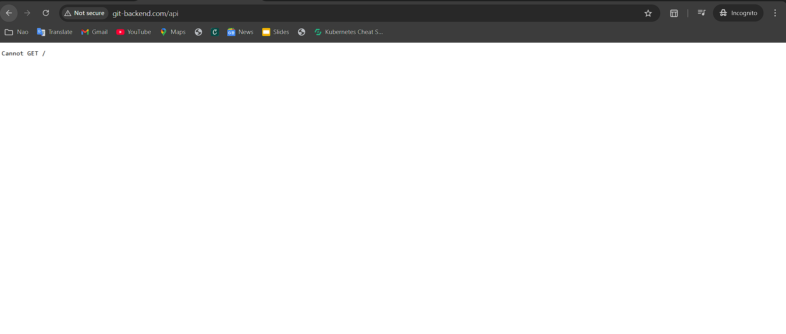

<div align="center" style="margin: 20px 0;">
  
  
  
</div>


# <div align="center">🛠️ Full-Stack React & Node.js App on Kubernetes (Minikube) 🚀</div>


## 📖 Overview

This project is a full-stack web application featuring a **React** frontend and **Node.js** backend, containerized and deployed on a local Kubernetes cluster using **Minikube**. It demonstrates key Kubernetes concepts such as deployment, service discovery, and ingress routing to manage multiple services under custom domains.

----------

## ✨ Features

-   ⚛️ **React Frontend** built with Vite, configured to allow custom domains.
    
-   🚀 **Node.js Backend** serving REST APIs.
    
-   📦 Kubernetes **Deployments** for managing app pods.
    
-   🔗 Kubernetes **Services** for service discovery and internal communication.
    
-   🌐 Kubernetes **Ingress** for routing external HTTP traffic based on hostnames.
    
-   🖥️ Local Kubernetes cluster using **Minikube** for development and testing.
    
-   🏷️ Custom domain routing configured via system hosts file.
    

----------

## 🛠️ Prerequisites

-   Docker installed and running
    
-   Minikube installed and running
    
-   kubectl CLI installed and configured
    
-   Node.js and npm (for local development)
    
-   Basic understanding of Kubernetes concepts
    

----------

## 🚀 Setup & Installation

### 1. Clone the repository

```bash
git clone https://github.com/KARTIKNAIK18/minkube-deployment-K8s.git
cd minkube-deployment-K8s

```

### 2. Build Docker images

Build frontend and backend Docker images (adjust tags as needed):

```bash
docker build -t frontend-image:latest -f frontend/Dockerfile .
docker build -t backend-image:latest -f backend/Dockerfile .

```

### 3. Push Inages to DockerHub(negligible)

```bash
docker push frontend-image:latest
docker push backend-image:latest

```

### 4. Deploy to Kubernetes

Apply Kubernetes manifests:

```bash
kubectl apply -f K8s/

```

This includes Deployments, Services, Namespace, and Ingress resources.

### 5. Check deployment and service status

```bash
kubectl get all -n git-app

```

### 6. Setup hosts file

Add entries mapping Minikube IP to your custom domains:

```
<minikube-ip>127.0.0.1  github-res.com 
<minikube-ip>/127.0.0.1 git-backend.com

```

Get Minikube IP:

```bash
minikube ip

```

### 7. Start Minikube tunnel (for Accesing SVC)

```bash
minikube tunnel

```

----------


## Make sure:

-   Your ingress controller (like nginx) is installed and running.
    
-   Your system hosts file points domains to Minikube IP.
    
-   The frontend service port matches the Vite server port.
    

----------

## 🧰 Useful Commands

### Restart deployments (to pick up config or image changes)

```bash
kubectl rollout restart deployment/frontend-deployment -n git-app
kubectl rollout restart deployment/backend-deployment -n git-app

```

### Check pod logs

```bash
kubectl logs -f deployment/frontend-deployment -n git-app
kubectl logs -f deployment/backend-deployment -n git-app

```

### Access frontend pod shell

```bash
kubectl exec -it <frontend-pod-name> -n git-app -- sh

```

### Delete pods to force restart

```bash
kubectl delete pod -l app=frontend -n git-app
kubectl delete pod -l app=backend -n git-app

```

----------

## 🛠️ Troubleshooting Tips

-   **Vite Host not allowed error:**  
    Ensure your `vite.config.js` includes:
    
    ```js
    server: {
      host: true,
      allowedHosts: ['your-domain-name','all']
    }
    
    ```
    
-   **Ingress 404 errors:**  
    Verify ingress rewrite-target annotation and service ports. Remove or adjust rewrite if needed.
    
-   **Minikube IP changes:**  
    Always check Minikube IP (`minikube ip`) / 127.0.0.1 and update your hosts file accordingly.

---

### Frontend Output


---

### Frontend Output


    

----------

## 📄 License


This project is licensed under the MIT License. See the [LICENSE](LICENSE) file for details.

----------


